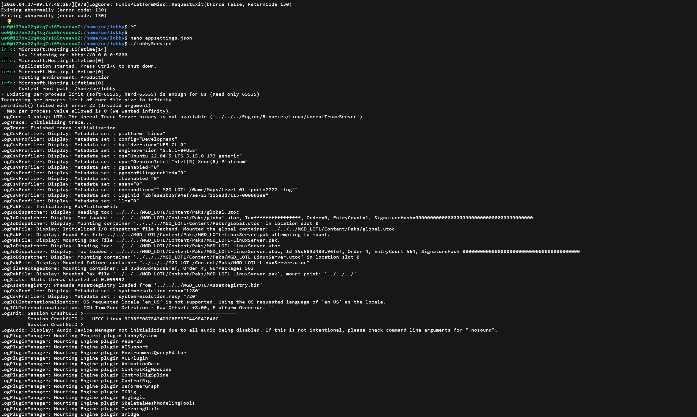
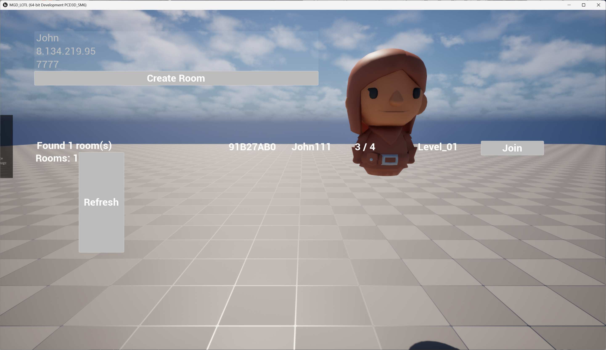

# UE5SimpleLobby
A C# game lobby service, faciliting UE5.6 clients, supporting create room, search room, join room APIs, and automatically start dedicated server.

Lobby Service serves the project MGD_LOTL based on "Multiplayer Game Development with Unreal Engine 5".

## Screenshots

